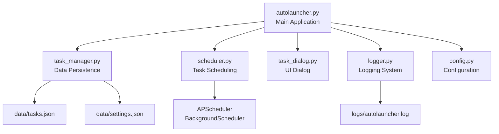

# Autolauncher - Complete Tutorial

## Building a Cross-Platform Program Scheduler with PySide6 and Fluent Widgets

Welcome to this comprehensive tutorial on building **Autolauncher**, a fully functional desktop application that allows users to schedule and automatically execute programs at specific times. This tutorial covers everything from environment setup to the complete implementation with modern Fluent Design UI.

---

## Table of Contents

1. [Environment Setup](#environment-setup)
2. [Architecture Overview](#architecture-overview)
3. [Implementation Guide](#implementation-guide)
4. [Icon Integration](#icon-integration)
5. [Running the Application](#running-the-application)
6. [Debugging and Logging](#debugging-and-logging)
7. [Building for Production](#building-for-production)

---

## Environment Setup

### Prerequisites

- **Python 3.9 or higher** (recommended for stability and compatibility)
- **pip** package manager
- **Virtual environment** (for dependency isolation)

### Step 1: Install Python

Download and install Python 3.9+ from [python.org](https://www.python.org/downloads/).

Verify installation:
```powershell
python --version
```

### Step 2: Create a Virtual Environment

Open PowerShell and navigate to your project directory:

```powershell
# Create project directory
mkdir Autolauncher
cd Autolauncher

# Create virtual environment
python -m venv venv

# Activate virtual environment
.\venv\Scripts\Activate.ps1
```

> [!NOTE]
> If you encounter execution policy errors, run: `Set-ExecutionPolicy -ExecutionPolicy RemoteSigned -Scope CurrentUser`

### Step 3: Install Required Dependencies

**Option A: Using requirements.txt (Recommended)**

The easiest way to install all dependencies at once:

```powershell
# Install all dependencies from requirements.txt
pip install -r requirements.txt
```

**Option B: Manual Installation**

Alternatively, install packages individually:

```powershell
# Install PySide6 (Qt6 bindings for Python)
pip install PySide6>=6.5.0

# Install PySide6-Fluent-Widgets (Fluent Design component library)
pip install PySide6-Fluent-Widgets>=1.7.0

# Install APScheduler (task scheduling library)
pip install APScheduler>=3.10.0
```

### Step 4: Verify Installation

Create a test script to verify all packages are installed correctly:

```python
# test_imports.py
try:
    from PySide6.QtWidgets import QApplication
    from qfluentwidgets import FluentWindow
    from apscheduler.schedulers.background import BackgroundScheduler
    print("✓ All dependencies installed successfully!")
except ImportError as e:
    print(f"✗ Import error: {e}")
```

Run the test:
```powershell
python test_imports.py
```

---

## Architecture Overview

Autolauncher follows a modular architecture with clear separation of concerns:



### Key Components

| Module | Purpose |
|--------|---------|
| **config.py** | Application settings, paths, and debug mode configuration |
| **logger.py** | Logging infrastructure with file rotation (development only) |
| **task_manager.py** | JSON-based CRUD operations for tasks and settings |
| **scheduler.py** | APScheduler wrapper for non-blocking task execution |
| **task_dialog.py** | Fluent Design dialog for task configuration |
| **autolauncher.py** | Main application window with table, theme switching, and system tray |

### Features

- ✨ **Fluent Design UI** - Modern Microsoft Fluent Design theme
- 🌓 **Theme Switching** - Toggle between Light and Dark modes
- ⏱️ **Countdown Timer** - Real-time display of time until task execution
- 📋 **Task Management** - Add, edit, and delete scheduled tasks
- 🔔 **System Tray** - Minimize to tray for background operation
- 💾 **Data Persistence** - JSON-based storage for tasks and settings
- 📊 **Logging** - Debug mode with detailed error tracking (development only)

---

## Implementation Guide

### 1. Configuration Module (`config.py`)

This module contains all application-wide settings and supports debug mode toggling via environment variable.

**Key Features:**
- Automatic directory creation for data and logs
- Environment-based debug mode (`DEBUG=1`)
- Configurable log levels and file rotation settings

**Debug Mode Usage:**
```powershell
# Enable debug mode (development)
$env:DEBUG=1
python autolauncher.py

# Disable debug mode (production)
$env:DEBUG=0
python autolauncher.py
```

### 2. Logging Module (`logger.py`)

Provides structured logging with console and file handlers.

**Features:**
- **Console Logging**: Always enabled for INFO and above
- **File Logging**: Only active when DEBUG=1
- **Log Rotation**: Automatically rotates logs at 5MB with 3 backups
- **Formatted Output**: Includes timestamps, module names, and line numbers

**Example Log Output:**
```
2025-11-21 13:00:00 - Autolauncher - INFO - autolauncher.py:50 - Application initialized
2025-11-21 13:00:15 - Autolauncher - DEBUG - scheduler.py:45 - Scheduled task 'Open Notepad' for 2025-11-21 14:00:00
```

### 3. Task Manager Module (`task_manager.py`)

Handles all data persistence using JSON files.

**TaskManager Class:**
- `load_tasks()` - Load tasks from JSON
- `save_tasks()` - Save tasks to JSON
- `add_task(task)` - Create new task
- `update_task(task_id, task)` - Update existing task
- `delete_task(task_id)` - Remove task
- `get_enabled_tasks()` - Get only active tasks

**SettingsManager Class:**
- Manages application settings (theme preference, window size)
- Auto-saves on changes

**Task Data Structure:**
```json
{
  "id": 1,
  "name": "Open Notepad",
  "program_path": "C:\\Windows\\System32\\notepad.exe",
  "schedule_time": "2025-11-21T14:00:00",
  "enabled": true,
  "created_at": "2025-11-21T13:00:00"
}
```

### 4. Scheduler Module (`scheduler.py`)

Wraps APScheduler's BackgroundScheduler for non-blocking task execution.

**Why BackgroundScheduler?**
- Runs in a separate thread, avoiding Qt event loop conflicts
- No need for AsyncIO integration
- Clean separation from UI logic

**Key Methods:**
- `add_job(task)` - Schedule a task
- `remove_job(task_id)` - Cancel a scheduled task
- `update_job(task)` - Reschedule a task
- `_execute_task(task)` - Execute program using subprocess

**Task Execution:**
```python
subprocess.Popen(
    program_path,
    shell=True,
    stdout=subprocess.PIPE,
    stderr=subprocess.PIPE
)
```

### 5. Task Dialog Module (`task_dialog.py`)

Modern Fluent Design dialog for task configuration.

**Fluent Widgets Used:**
- `MessageBoxBase` - Base dialog class
- `SubtitleLabel` - Dialog title
- `LineEdit` - Text input with clear button
- `PushButton` - Fluent-styled button
- `DatePicker` - Calendar date selector
- `TimePicker` - Time selector

**Input Validation:**
- Task name must not be empty
- Program path must exist on disk
- Scheduled time must be in the future

**Usage Example:**
```python
dialog = TaskDialog(parent=self, task_data=existing_task)
if dialog.exec():
    if dialog.validate_input():
        task_data = dialog.get_task_data()
        # Save task...
```

### 6. Main Application Module (`autolauncher.py`)

The heart of the application with Fluent Design UI.

#### Table Widget

Displays all scheduled tasks with 5 columns:

| Column | Description |
|--------|-------------|
| **Task Name** | User-defined task name |
| **Program Path** | Full path to executable |
| **Schedule** | Scheduled date and time |
| **Countdown** | Real-time countdown timer |
| **Status** | Enabled/Disabled state |

#### Countdown Timer Logic

Updated every second using `QTimer`:

```python
def _calculate_countdown(self, task: dict) -> str:
    schedule_time = datetime.fromisoformat(task['schedule_time'])
    delta = schedule_time - datetime.now()
    
    days = delta.days
    hours, remainder = divmod(delta.seconds, 3600)
    minutes, seconds = divmod(remainder, 60)
    
    if days > 0:
        return f"{days}d {hours}h {minutes}m"
    elif hours > 0:
        return f"{hours}h {minutes}m {seconds}s"
    else:
        return f"{minutes}m {seconds}s"
```

#### Theme Switching

Toggle between Light and Dark themes with a single click:

```python
def _toggle_theme(self):
    current_theme = self.settings_manager.get('theme', 'Light')
    
    if current_theme == 'Light':
        new_theme = 'Dark'
        setTheme(Theme.DARK)
    else:
        new_theme = 'Light'
        setTheme(Theme.LIGHT)
    
    self.settings_manager.set('theme', new_theme)
```

The theme preference is automatically saved and restored on next launch.

#### System Tray Integration

Allows the application to run in the background:

- **Double-click tray icon**: Show/hide window
- **Right-click menu**: Show, Hide, Exit options
- **Close button**: Minimizes to tray instead of exiting

---

## Icon Integration

### Application Window Icon

To set a custom icon for the main window:

```python
# In autolauncher.py __init__ method:
from PySide6.QtGui import QIcon

self.setWindowIcon(QIcon("path/to/your/icon.png"))
```

### System Tray Icon

To use a custom system tray icon:

```python
# In _setup_system_tray method:
self.tray_icon.setIcon(QIcon("path/to/your/tray_icon.png"))
```

### Button Icons

Fluent Widgets provides built-in icons via `FluentIcon` enum:

```python
from qfluentwidgets import FluentIcon, PushButton

button = PushButton(FluentIcon.ADD, "Add Task")
```

**Available Icons:**
- `FluentIcon.ADD` - Plus sign
- `FluentIcon.EDIT` - Pencil
- `FluentIcon.DELETE` - Trash can
- `FluentIcon.CALENDAR` - Calendar
- `FluentIcon.CONSTRACT` - Theme toggle
- And many more in the qfluentwidgets documentation

### Custom Icons

For custom icons, use standard image formats (PNG, SVG):

```python
from PySide6.QtGui import QIcon
from qfluentwidgets import PushButton

custom_button = PushButton(QIcon("icons/custom.png"), "Custom")
```

> [!TIP]
> Use 256x256 PNG files for crisp icons at all DPI settings

---

## Running the Application

### Development Mode (with Debug Logging)

```powershell
# Activate virtual environment
.\venv\Scripts\Activate.ps1

# Enable debug mode
$env:DEBUG=1

# Run application
python autolauncher.py
```

This will:
- Create `logs/autolauncher.log` with detailed debug information
- Show debug messages in console
- Log all scheduler events and errors

### Standard Mode (without Debug Logging)

```powershell
# Activate virtual environment
.\venv\Scripts\Activate.ps1

# Run application
python autolauncher.py
```

This will:
- Skip file logging
- Show only INFO level messages in console
- Provide cleaner output for end users

### First Launch

On first launch, the application will:
1. Create `data/` directory for storing tasks and settings
2. Create empty `tasks.json` and `settings.json`
3. Apply default Light theme
4. Show empty task table

### Adding Your First Task

1. Click **"Add Task"** button
2. Enter a task name (e.g., "Open Notepad")
3. Click **"Browse..."** to select an executable
4. Set the schedule date and time
5. Click **"Add Task"**
6. Watch the countdown timer update in real-time!

### Testing the Scheduler

To test if scheduling works:

1. Create a task scheduled 1-2 minutes in the future
2. Use a simple program like `notepad.exe`
3. Watch the countdown timer approach zero
4. The program should launch automatically at the scheduled time
5. Check `logs/autolauncher.log` (if DEBUG=1) for execution confirmation

---

## Debugging and Logging

### Enabling Debug Mode

**Via Environment Variable:**
```powershell
$env:DEBUG=1
python autolauncher.py
```

**Via config.py (permanent):**
```python
# In config.py, change:
DEBUG_MODE = True  # Force debug mode ON
```

### Log File Location

Logs are saved to: `logs/autolauncher.log`

### Log File Rotation

- **Max size**: 5 MB per file
- **Backups**: 3 files kept (autolauncher.log.1, .2, .3)
- **Old logs**: Automatically deleted

### Common Debug Scenarios

#### Task Not Executing

Check the logs for:
```
ERROR - Failed to execute task 'TaskName': [Errno 2] No such file or directory
```
**Solution**: Verify the program path exists

#### Scheduled Time in Past

```
WARNING - Task 'TaskName' scheduled time is in the past, skipping
```
**Solution**: Edit the task with a future time

#### Permission Denied

```
ERROR - Permission denied for task 'TaskName': C:\Program Files\app.exe
```
**Solution**: Run as administrator or choose a different program

### Troubleshooting Guide

| Issue | Solution |
|-------|----------|
| Import errors | Reinstall dependencies: `pip install -r requirements.txt` |
| Theme not saving | Check `data/settings.json` permissions |
| Tasks not persisting | Verify `data/tasks.json` is writable |
| Countdown not updating | Check if QTimer is running (should start automatically) |
| System tray not showing | Some Linux distros require tray extensions |

---

## Building for Production

### Disabling Debug Logging

Before distributing your application:

1. **Remove environment variable**:
   ```powershell
   Remove-Item Env:\DEBUG
   ```

2. **Verify debug mode is OFF**:
   - No `logs/` directory should be created
   - Only INFO-level console messages appear

### Creating a Requirements File

Save dependencies for easy installation:

```powershell
pip freeze > requirements.txt
```

### Packaging with PyInstaller (Optional)

To create a standalone executable:

```powershell
# Install PyInstaller
pip install pyinstaller

# Create executable
pyinstaller --onefile --windowed --name Autolauncher --icon=icon.ico autolauncher.py
```

This creates `dist/Autolauncher.exe` - a single executable file.

> [!CAUTION]
> PyInstaller bundles may be flagged by antivirus software. Sign your executable or distribute as Python scripts.

### Distribution Checklist

- [ ] Debug mode disabled (`DEBUG=0`)
- [ ] No log files included in distribution
- [ ] `data/` directory excluded (will be auto-created)
- [ ] Custom icons included in package
- [ ] `requirements.txt` provided for pip installation
- [ ] README with installation instructions

---

## Summary

You've now built a complete, production-ready program scheduler with:

✅ **Modern Fluent Design UI** with PySide6-Fluent-Widgets  
✅ **Theme switching** (Light/Dark modes)  
✅ **Real-time countdown timers** showing time until execution  
✅ **Background scheduling** with APScheduler  
✅ **System tray integration** for background operation  
✅ **Comprehensive logging** for development debugging  
✅ **Data persistence** with JSON  

### Next Steps

- **Add recurring tasks**: Modify scheduler to support cron-style schedules
- **Notifications**: Add toast notifications when tasks execute
- **Task history**: Log completed task executions
- **Advanced scheduling**: Support multiple schedules per task
- **Import/Export**: Allow backup and restore of task configurations

### Additional Resources

- [PySide6 Documentation](https://doc.qt.io/qtforpython/)
- [PySide6-Fluent-Widgets Gallery](https://qfluentwidgets.com/pages/components/)
- [APScheduler Documentation](https://apscheduler.readthedocs.io/)
- [Python Logging Cookbook](https://docs.python.org/3/howto/logging-cookbook.html)

---

**Happy Coding! 🚀**

*Tutorial created for building cross-platform GUI applications with Python and Fluent Design.*
